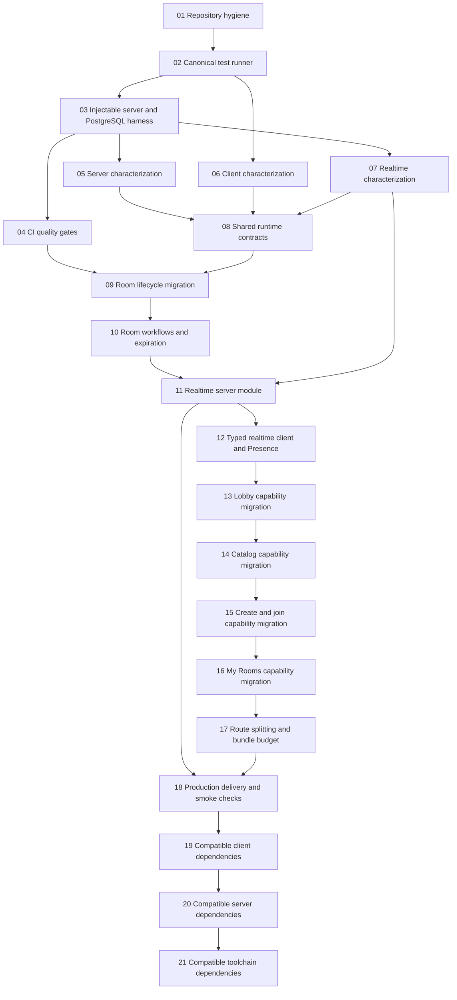

# Squadzr modernization roadmap

- Status: accepted for planning
- Date: 2026-07-27
- Scope: incremental modernization without a rewrite

## Objective

Make the monorepo safer to change, easier to navigate, and more reliable in production while
preserving Squadzr's product purpose: form a squad in an open room and hand a ready squad off to
Discord.

The cycle establishes a clean baseline, adds regression protection, clarifies shared contracts and
the room lifecycle, deepens the realtime module, migrates the client incrementally by product
capability, and introduces gated automatic delivery.

## Product and architecture constraints

- Fastify, React, PostgreSQL, Drizzle, Better Auth, Bun, Turbo, and the monorepo remain in place.
- The server keeps the dependency direction `interface -> application -> domain`; infrastructure
  continues to implement domain ports.
- Business workflows live in application modules. Fastify routes, WebSocket handlers, schedulers,
  and controllers remain adapters.
- Concrete repositories and application modules are assembled only in interface factories.
- Trivial read adapters do not require pass-through use cases with no behavior.
- Vercel remains the client host. Railway remains the host for one persistent Fastify instance and
  managed PostgreSQL.
- No Redis, distributed broker, queue, transactional outbox, microservice split, or hosting
  migration is introduced.
- HTTP behavior, authentication, and existing business rules remain compatible except for the
  explicitly accepted removal of the unused room `status` field.
- WebSocket protocol changes are allowed because the client and server are deployed together.
- Current room, membership, and room-ready notification records may be deleted during the lifecycle
  migration. User and authentication records must be preserved.
- Major dependency migrations are outside this cycle.

## Accepted domain model

The canonical vocabulary is defined in [`server/CONTEXT.md`](../../server/CONTEXT.md).

- **Membership** is the durable association between a user and a room.
- **Presence** is transient and never changes Membership.
- A member is online in a room while at least one healthy live session is participating in that
  room.
- **Room Activity** advances only on a durable Membership change, not on reads, views, heartbeats,
  or reconnects.
- An **Open Room** accepts Memberships.
- A **Ready Room** has reached capacity, locks Membership changes, leaves the public catalog
  immediately, and completes the product's handoff to Discord.

Lifecycle rules:

| State      | Entry                                                  | Public catalog                             | Member access                                         | Expiration                                        |
| ---------- | ------------------------------------------------------ | ------------------------------------------ | ----------------------------------------------------- | ------------------------------------------------- |
| Open Room  | Created with `lastActivityAt`                          | Visible and joinable while it has capacity | Accessible                                            | Delete after 24 hours without Membership activity |
| Ready Room | Last required Membership is added and `readyAt` is set | Removed immediately                        | Existing members retain lobby and Discord link access | Delete 60 minutes after `readyAt`                 |
| Deleted    | Open or ready retention expires                        | Not visible                                | Not accessible                                        | Memberships are removed by cascade                |

Membership activity resets the 24-hour timer on creation, successful join, and successful leave.
Presence changes do not reset it.

## Recorded decisions

- [`docs/adr/0001-own-runtime-contracts-in-schemas.md`](../adr/0001-own-runtime-contracts-in-schemas.md)
- [`docs/adr/0002-keep-vercel-and-railway-hosting.md`](../adr/0002-keep-vercel-and-railway-hosting.md)
- [`client/docs/adr/0001-organize-client-by-capability.md`](../../client/docs/adr/0001-organize-client-by-capability.md)
- [`server/docs/adr/0001-model-room-lifecycle-with-timestamps.md`](../../server/docs/adr/0001-model-room-lifecycle-with-timestamps.md)
- [`server/docs/adr/0002-use-state-snapshots-for-realtime-convergence.md`](../../server/docs/adr/0002-use-state-snapshots-for-realtime-convergence.md)

## Baseline observed on 2026-07-26

| Check                   | Result                                              | Consequence                                             |
| ----------------------- | --------------------------------------------------- | ------------------------------------------------------- |
| Typecheck               | Passes in all workspaces                            | Preserve as a required gate                             |
| Server tests            | 39 pass across 10 use-case specs                    | Retain and migrate to the canonical runner              |
| Client tests            | No test files                                       | Add characterization before client restructuring        |
| Shared-package tests    | No test files                                       | Add contract tests                                      |
| Lint                    | Passes with a React-detection warning in the server | Split workspace configuration and require zero warnings |
| Format check            | Fails for 174 files                                 | Normalize LF in a mechanical-only change                |
| Client production build | Passes; one 956.12 kB JS chunk, 304.71 kB gzip      | Add route splitting and a bundle budget                 |
| Server production build | Passes; 3.81 MB bundle                              | Record only; optimize only if profiling finds a problem |
| WebSocket tests         | None                                                | Protect protocol, reconnection, snapshots, and Presence |
| CI                      | No repository workflow                              | Add GitHub Actions and protected deployment gates       |
| Domain documentation    | Did not exist                                       | Added context map, glossary, and focused ADRs           |

Additional findings:

- Runtime transport types are duplicated manually between `@squadzr/types` and
  `@squadzr/schemas`.
- HTTP dates are typed as `Date` in the client even though JSON transports strings, and responses
  are not validated at the client seam.
- Room state is represented twice by an unused `status` enum and `completedAt`; the actual behavior
  follows the timestamp.
- Open rooms never expire today, allowing abandoned rooms to consume create/join limits forever.
- `markLegacyFullRooms` is startup compatibility code rather than a durable lifecycle rule.
- `readyNotifiedAt` is currently written before notification creation and does not provide
  idempotency or retry safety.
- WebSocket infrastructure creates Drizzle repositories outside factories and contains application
  decisions.
- Realtime client interfaces fall back to `string` and `unknown` after defining shared Zod schemas.
- The current event stream conflates Membership changes with socket Presence.
- The client route and dialog hotspots mix server state, realtime coordination, local state, and
  presentation in files between roughly 300 and 409 lines.
- The server entry point starts on import and the database is a module singleton, making integration
  tests and controlled shutdown harder.
- Dependency updates include safe patch/minor updates and several unrelated major migrations.

## Target module seams

### Shared contracts

`@squadzr/schemas` owns HTTP and WebSocket transport schemas and exports their inferred input and
output types. Transport dates are represented as ISO strings. Domain and application modules map
between transport values and domain values at their adapters.

`@squadzr/types` retains only genuinely static shared types without a runtime representation. If a
type becomes a pure re-export after the migration, callers import it directly from
`@squadzr/schemas`.

The client validates responses at the HTTP and WebSocket seams. A contract validation failure
produces a typed error and structured diagnostic rather than allowing invalid data into feature
state.

### Server application

Application modules own multi-step room workflows:

- create an Open Room and initial host Membership;
- join an Open Room atomically and transition it to Ready when capacity is reached;
- leave an Open Room and update Room Activity;
- retry idempotent room-ready notifications;
- expire idle Open Rooms and retained Ready Rooms;
- describe a room snapshot for an authorized member.

Repository adapters retain storage mechanics such as PostgreSQL locks and transactions. Cross-table
updates that must be atomic, including Membership plus `lastActivityAt`/`readyAt`, occur in one
database transaction behind a domain port. Tests use an in-memory adapter through the same seam;
PostgreSQL integration tests verify locking and query behavior.

### Realtime server

The realtime module exposes a small application-facing publishing interface and hides socket maps,
serialization, heartbeat, Presence aggregation, timers, and Fastify details.

Its implementation maintains room Presence by member and session:

- first healthy room session marks a member online;
- additional tabs or sessions do not duplicate the member;
- loss of the last session schedules offline after 10 seconds;
- reconnect within the grace window cancels offline;
- graceful disconnect is still debounced to avoid UI flicker;
- heartbeat detects a silent failure and emits offline within 60 seconds;
- leaving a route affects Presence only and never Membership.

PostgreSQL remains the source of truth. Every room subscription and resubscription returns a complete
snapshot containing the room, Membership roster, ready state, and online state. Incremental events
are best-effort hints; clients tolerate duplicates and converge from a later snapshot.

### Client rooms capability

TanStack route files become thin entry points. The rooms capability owns catalog, creation, joining,
lobby, and "my rooms" implementations while exposing only route-level modules.

```text
client/src/
|-- routes/rooms/                  # thin TanStack route registrations
|-- features/rooms/
|   |-- index.ts                   # public interface
|   |-- catalog/
|   |-- create-room/
|   |-- join-room/
|   |-- lobby/
|   `-- my-rooms/
|-- components/ui/                 # generic UI only
`-- lib/                           # generic HTTP, auth, query, and WebSocket transports
```

The lobby module hides queries, typed realtime subscription, snapshot reconciliation, Membership
roster state, Presence state, connection status, and commands behind one cohesive interface.
Presence appears as a green/gray indicator with an accessible Online/Offline label and tooltip.

### Delivery

GitHub Actions owns repository checks. Vercel and Railway deploy `main` automatically only after
required checks pass. Database migrations run as a controlled pre-deploy step; a migration failure
prevents server deployment. Post-deploy smoke checks cover readiness, one public HTTP endpoint, and
the WebSocket handshake.

## Execution principles

- One Linear implementation issue maps to one focused branch, one task commit, and one PR.
- Do not combine mechanical formatting, dependency upgrades, schema changes, and behavioral
  refactors in the same PR.
- Each PR must be independently reviewable and deployable unless its issue explicitly marks a
  coordinated client/server contract release.
- Add tests at the module interface before replacing implementation details.
- Retire tests that assert internals after equivalent interface-level coverage exists.
- Keep issue estimates at `5` or below; split any issue that grows to an `8`.
- Do not add a port with only one justified adapter. Production plus an in-memory test adapter is a
  valid seam.
- Do not optimize server or database code without a recorded baseline and a regression threshold.
- Preserve the pre-existing uncommitted `bun.lock` change unless its owner explicitly scopes it into
  an implementation task.

## Dependency graph



## Linear-ready implementation issues

### 01. Normalize repository formatting and lint ownership

- Priority: P1
- Estimate: 2
- Labels: `ready-for-agent`, `area:shared`
- Blocked by: none

Context:

The repository requires LF but has no `.gitattributes`; Windows checkouts produce CRLF and fail
Prettier in 174 files. The root ESLint config loads React settings for the server.

Scope:

- add `.gitattributes` with explicit LF normalization and binary exclusions;
- normalize tracked text once;
- keep the formatting-only diff free of semantic edits;
- split or override lint configuration so React rules load only for the client;
- align test globals with the selected runner;
- define deterministic root `format`, `format:check`, and zero-warning lint behavior.

Acceptance criteria:

- `bun run format:check` passes on Windows and CI;
- `bun run lint` produces no warnings;
- generated and binary files have explicit formatting policy;
- code behavior and generated route topology are unchanged;
- the PR contains no dependency or functional changes.

### 02. Standardize the test runner and workspace commands

- Priority: P1
- Estimate: 3
- Labels: `ready-for-agent`, `area:shared`, `area:frontend`, `area:backend`
- Blocked by: 01

Context:

Server tests use Bun's test runner while the repository declares Vitest for all workspaces, and the
client's package script bypasses the root jsdom workspace configuration.

Scope:

- use Vitest as the canonical runner in client, server, and shared packages;
- preserve existing server assertions while migrating runner imports/configuration;
- provide jsdom setup for client tests;
- define unit and integration projects explicitly;
- make `bun run test` the single full-suite entry point;
- retain focused workspace commands for local development.

Acceptance criteria:

- all 39 existing server tests pass under the canonical runner;
- an empty workspace cannot silently hide a missing expected test project;
- client tests run in jsdom;
- package contract tests run in Node;
- root and workspace test commands produce the same test inventory.

### 03. Make the Fastify server and database injectable for integration tests

- Priority: P1
- Estimate: 5
- Labels: `ready-for-agent`, `area:backend`, `area:database`
- Blocked by: 02

Context:

`server/src/index.ts` starts the process on import and the database is a module singleton, preventing
isolated Fastify instances and controlled PostgreSQL lifecycle in tests.

Scope:

- separate `buildServer` from the executable entry point;
- inject environment, database, logger, scheduler clock, and realtime adapter where variation is
  justified;
- create/close database pools per application instance;
- provide a PostgreSQL 16 integration harness using an isolated test database or schema;
- apply Drizzle migrations automatically for integration suites;
- keep production startup and graceful shutdown behavior equivalent.

Acceptance criteria:

- tests can build and close more than one isolated server instance;
- no production listener starts when modules are imported;
- test database state is isolated and deterministic;
- SIGTERM/SIGINT shutdown closes Fastify, WebSocket sessions, timers, and the pool;
- production build still starts with the existing environment contract.

### 04. Add repository-owned CI quality gates

- Priority: P1
- Estimate: 3
- Labels: `ready-for-agent`, `area:infrastructure`, `area:shared`
- Blocked by: 01, 02, 03

Context:

The GitHub repository has no CI workflow.

Scope:

- add GitHub Actions using the pinned Bun version and frozen lockfile;
- provision PostgreSQL 16 for integration tests;
- run format check, lint, typecheck, unit tests, integration tests, and production builds;
- cache Bun and Turbo artifacts without hiding test execution;
- configure required-check names suitable for branch protection;
- upload useful logs on failure without exposing secrets.

Acceptance criteria:

- a pull request runs every required check from a clean checkout;
- warnings fail the relevant quality gate;
- PostgreSQL integration tests run in CI;
- failed checks prevent merge through documented branch-protection settings;
- CI performs no production deployment yet.

### 05. Characterize server HTTP and repository behavior

- Priority: P1
- Estimate: 5
- Labels: `ready-for-agent`, `area:backend`, `area:database`
- Blocked by: 03

Context:

Application use cases have unit coverage, but controllers, routes, serialization, repositories, auth
guards, and concurrent capacity behavior do not.

Scope:

- characterize create, list, get, join, leave, "my rooms," notification, and error responses;
- test authentication and ownership constraints;
- test unique room-code retry and membership capacity locking against PostgreSQL;
- protect the HTTP behavior that is not deliberately changed by the roadmap;
- document tests that are intentionally expected to change in the lifecycle migration.

Acceptance criteria:

- critical HTTP flows are covered through Fastify injection;
- repository integration tests exercise actual PostgreSQL transactions;
- concurrent joins cannot overfill a room;
- auth and validation failures have stable response schemas;
- tests distinguish durable Membership from transport Presence.

### 06. Characterize critical client room flows

- Priority: P1
- Estimate: 3
- Labels: `ready-for-agent`, `area:frontend`
- Blocked by: 02

Context:

The client has no tests and its room routes will be structurally migrated.

Scope:

- test catalog loading, filters, create, authenticated join, leave, and lobby rendering;
- test query-cache updates and error presentation;
- test room-ready Discord access;
- isolate transport adapters with deterministic test adapters;
- assert user-observable behavior rather than current file structure.

Acceptance criteria:

- critical room flows have stable UI-level characterization tests;
- tests survive moving implementations into feature modules;
- failures from HTTP contract validation are visible and actionable;
- no test depends on private hook state or generated route internals.

### 07. Characterize realtime protocol and reconnection behavior

- Priority: P1
- Estimate: 5
- Labels: `ready-for-agent`, `area:realtime`, `area:backend`, `area:frontend`
- Blocked by: 02, 03

Context:

The current protocol, connection manager, reconnection loop, and room handlers have no tests.

Scope:

- protect authenticated and guest connection behavior;
- test catalog and room subscription cleanup;
- characterize invalid-message handling and payload limits;
- test reconnect and resubscribe behavior with fake timers;
- record current Membership/Presence conflation as behavior to replace, not preserve.

Acceptance criteria:

- protocol tests run without real network flakiness;
- abnormal and graceful disconnect paths are covered;
- current regression-sensitive behavior is documented;
- new snapshot and Presence tests can be added test-first in issues 11 and 12.

### 08. Make Zod schemas the runtime contract source of truth

- Priority: P1
- Estimate: 5
- Labels: `ready-for-agent`, `area:shared`, `area:backend`, `area:frontend`
- Blocked by: 05, 06, 07

Context:

Shared types and schemas duplicate room, notification, API, and WebSocket shapes. The client trusts
unvalidated JSON and models serialized dates as `Date`.

Scope:

- define HTTP request/response and WebSocket envelope schemas in `@squadzr/schemas`;
- infer transport types from those schemas;
- model JSON dates as ISO strings;
- map transport values to domain values at server adapters where needed;
- parse client HTTP responses and WebSocket messages at their seams;
- remove duplicated runtime-representable types from `@squadzr/types`;
- add schema compatibility and invalid-payload tests.

Acceptance criteria:

- every external room and realtime contract has one Zod source;
- no transport type manually duplicates a schema;
- invalid HTTP and WebSocket payloads cannot enter feature state;
- current payload formats remain compatible except for the accepted later removal of room `status`;
- workspace dependency direction has no cycle.

### 09. Migrate the persisted room lifecycle

- Priority: P1
- Estimate: 5
- Labels: `ready-for-agent`, `area:database`, `area:backend`, `area:shared`
- Blocked by: 04, 08

Context:

The unused status enum contradicts the timestamp-driven lifecycle, and open rooms have no
inactivity expiration.

Scope:

- delete disposable room, room-membership, and room-ready notification records while preserving
  auth/users;
- rename `completed_at` to `ready_at`;
- add non-null `last_activity_at` with an appropriate creation default;
- remove the room `status` column and PostgreSQL enum;
- remove `RoomStatus` and the transport `status` field;
- update Drizzle schema, snapshots, repositories, domain entities, schemas, seed/test fixtures, and
  Swagger descriptions;
- remove startup-only `markLegacyFullRooms`.

Acceptance criteria:

- migration succeeds from the current Railway schema;
- users and authentication records remain intact;
- room-related legacy data is removed deliberately;
- rollback limitations are documented before production execution;
- domain and transport models contain no speculative playing/finished state;
- repository integration tests cover the new columns and filters.

### 10. Implement explicit room activity, readiness, expiration, and notification retry

- Priority: P1
- Estimate: 5
- Labels: `ready-for-agent`, `area:backend`, `area:database`
- Blocked by: 09

Context:

The accepted lifecycle requires atomic Membership activity, immediate catalog removal at readiness,
two expiration clocks, and retryable room-ready notifications.

Scope:

- update `lastActivityAt` atomically on create, successful join, and successful leave;
- transition the room to `readyAt` atomically when the final Membership is inserted;
- reject all Membership changes after readiness;
- list only non-expired Open Rooms in the public catalog;
- authorize Ready Room access only for existing members during the 60-minute retention;
- expire Open Rooms after 24 hours without Membership activity;
- expire Ready Rooms 60 minutes after `readyAt`;
- add notification idempotency keys and retry incomplete room-ready notification delivery;
- remove or repurpose `readyNotifiedAt` only if its new invariant is explicit and tested;
- broadcast deletion/catalog hints after committed state changes.

Acceptance criteria:

- reads, Presence, heartbeats, and reconnects never update Room Activity;
- concurrent final joins produce one ready transition;
- a Ready Room is immediately absent from the public catalog;
- existing members can access it for 60 minutes;
- expiration uses an injected clock and deterministic tests;
- notification retries produce one logical notification per member;
- scheduler failures are logged and retried without crashing Fastify.

### 11. Deepen the single-instance realtime server module

- Priority: P1
- Estimate: 5
- Labels: `ready-for-agent`, `area:realtime`, `area:backend`
- Blocked by: 07, 10

Context:

The current WebSocket plugin creates concrete repositories, performs application queries, exposes
socket-oriented handlers, and conflates Membership with Presence.

Scope:

- assemble realtime dependencies in an interface factory;
- inject an application-facing room snapshot/query module and publisher interface;
- replace repository access inside WebSocket infrastructure;
- define Zod-discriminated client/server messages for subscription, snapshot, Membership,
  Presence, catalog, heartbeat, and errors;
- maintain per-room, per-member, per-session connection state;
- implement 10-second last-session offline grace;
- implement heartbeat with silent-failure offline detection within 60 seconds;
- send a complete snapshot on every room subscription/resubscription;
- make disconnect idempotent and cancel all timers on shutdown.

Acceptance criteria:

- infrastructure handlers contain no business decisions or concrete repository construction;
- multiple tabs count as one online member;
- closing one of multiple tabs does not emit offline;
- reconnect within 10 seconds avoids an offline transition;
- silent failures converge to offline within 60 seconds;
- a lost incremental event is repaired by the next snapshot;
- no Redis, broker, queue, or horizontal-scale abstraction is introduced.

### 12. Implement the typed realtime client and accessible Presence

- Priority: P1
- Estimate: 5
- Labels: `ready-for-agent`, `area:realtime`, `area:frontend`, `area:shared`
- Blocked by: 11

Context:

The current client accepts string event names and unknown payloads, and it cannot expose reliable
member Presence.

Scope:

- replace string/unknown event calls with typed messages inferred from Zod schemas;
- implement an explicit connection/reconnection state machine with exponential backoff and jitter;
- resubscribe and apply the authoritative snapshot after reconnect;
- make duplicate incremental events harmless;
- expose room Membership and Presence through a cohesive client interface;
- render green/gray member indicators with Online/Offline text for assistive technology and a
  tooltip;
- retain a visible overall connection state.

Acceptance criteria:

- callers cannot send an invalid event name/payload without a type or runtime failure;
- malformed server messages are rejected at the transport seam;
- snapshots replace stale state deterministically;
- duplicate events do not duplicate members;
- Presence behavior matches multi-tab and grace-window rules;
- indicators do not rely on color alone.

### 13. Migrate the room lobby into a capability module

- Priority: P2
- Estimate: 5
- Labels: `ready-for-agent`, `area:frontend`, `area:realtime`
- Blocked by: 06, 12

Context:

The lobby route mixes HTTP queries, WebSocket events, Membership state, Presence, navigation, copy
state, and presentation.

Scope:

- create `features/rooms/lobby`;
- expose a small route-level lobby interface;
- internalize snapshot reconciliation, room/game queries, Presence, leave command, and copy state;
- move lobby-specific UI beside the capability implementation;
- keep generic UI and generic transports shared;
- reduce the TanStack route to registration and rendering.

Acceptance criteria:

- lobby behavior remains covered through the feature interface;
- the route knows no event names, query keys, or cache mutation details;
- membership and Presence terminology is used consistently;
- leaving a route changes Presence only;
- leaving a room invokes the Membership workflow;
- no catch-all hook or barrel exposes internal implementation seams.

### 14. Migrate the room catalog into a capability module

- Priority: P2
- Estimate: 5
- Labels: `ready-for-agent`, `area:frontend`, `area:realtime`
- Blocked by: 13

Context:

The catalog route owns data fetching, realtime cache updates, filtering, pagination, auth-driven
join behavior, and presentation.

Scope:

- create `features/rooms/catalog`;
- internalize room/game queries, filters, pagination, and catalog realtime subscription;
- keep URL search parameters as the public navigation state;
- remove Ready and expired rooms based on authoritative server state;
- make catalog cache updates idempotent;
- reduce the route to registration and rendering.

Acceptance criteria:

- catalog tests remain behavior-focused and pass after the move;
- feature callers do not know query keys or event names;
- filters and pagination retain URL behavior;
- realtime snapshot/event convergence cannot duplicate rooms;
- the route file is a thin entry point.

### 15. Migrate create and join flows into capability modules

- Priority: P2
- Estimate: 5
- Labels: `ready-for-agent`, `area:frontend`
- Blocked by: 14

Context:

The 409-line create dialog and catalog route mix form schema concerns, mutations, auth redirect,
navigation, and UI.

Scope:

- create `features/rooms/create-room` and `features/rooms/join-room`;
- use shared Zod contracts directly with React Hook Form;
- remove unsafe `as unknown as` form casts;
- internalize mutation, auth redirect, pending code, errors, and navigation;
- split visual form sections only where they form cohesive internal modules.

Acceptance criteria:

- create and join behavior remains unchanged apart from new lifecycle validation;
- form values are inferred from the shared schema without unsafe double casts;
- auth callback preserves the intended room code;
- mutation errors use typed contract/application errors;
- public feature interfaces remain smaller than their implementations.

### 16. Migrate My Rooms and close the old rooms folders

- Priority: P2
- Estimate: 3
- Labels: `ready-for-agent`, `area:frontend`
- Blocked by: 15

Context:

The final room capability must remove split ownership across routes, generic hooks, and
`components/rooms`.

Scope:

- create `features/rooms/my-rooms`;
- migrate remaining room-specific modules from global hooks/components;
- keep only genuinely generic UI in `components/ui`;
- define and enforce the rooms capability public interface;
- delete obsolete pass-through barrels and dead helpers.

Acceptance criteria:

- no room-specific implementation remains in global hooks or generic component folders;
- all room routes import only the public rooms capability interface;
- no circular feature dependencies exist;
- all characterization tests pass;
- deleted modules pass the deletion test: their complexity has moved behind a deeper interface, not
  been copied across callers.

### 17. Add route code splitting and a client bundle budget

- Priority: P2
- Estimate: 3
- Labels: `ready-for-agent`, `area:frontend`, `area:infrastructure`
- Blocked by: 16

Context:

The current client emits one 956.12 kB JavaScript chunk.

Scope:

- enable TanStack/Vite route-level code splitting compatible with the pinned versions;
- lazy-load nonessential landing and room capability code;
- produce a build manifest and deterministic bundle report;
- add CI budgets for initial gzip and maximum raw chunk size;
- update Browserslist data in the compatible-maintenance lane if required.

Acceptance criteria:

- no production JavaScript chunk exceeds Vite's 500 kB raw warning threshold;
- initial JavaScript is at most 200 kB gzip, or a measured exception is documented before merge;
- CI fails on budget regression;
- route navigation and loading states are covered;
- no server/database optimization is included without profiling.

### 18. Enable gated automatic deployment and production smoke checks

- Priority: P1
- Estimate: 3
- Labels: `ready-for-agent`, `area:infrastructure`, `area:database`, `area:realtime`
- Blocked by: 04, 11, 17

Context:

Vercel and Railway are the accepted hosts, but the repository has no gated delivery workflow.

Scope:

- require GitHub checks before merging `main`;
- configure Vercel and Railway production deployment from protected `main`;
- execute Drizzle migrations as a Railway pre-deploy gate;
- add readiness, public HTTP, and WebSocket handshake smoke checks;
- document secrets, deployment ownership, rollback steps, and the one-time disposable-room cleanup;
- add structured Pino logs for lifecycle transitions, scheduler failures, WebSocket connection
  counts, invalid messages, heartbeat timeouts, and notification retries without logging secrets.

Acceptance criteria:

- failed checks or migrations prevent production deployment;
- a successful `main` merge deploys both applications automatically;
- post-deploy smoke checks identify the deployed revision;
- rollback instructions account for irreversible schema changes;
- Railway can shut down the server gracefully;
- production diagnostics distinguish Membership, Presence, and transport failures.

### 19. Update compatible client runtime dependencies

- Priority: P2
- Estimate: 3
- Labels: `ready-for-agent`, `area:frontend`
- Blocked by: 18

Context:

The client has compatible runtime updates as well as unrelated major migrations. Runtime changes
must not be mixed with server or toolchain maintenance.

Scope:

- update client runtime dependencies that remain within accepted major lines;
- review official changelogs for behavior or browser-support changes;
- retain React 18 and all other accepted major versions;
- run client characterization, contract, bundle, and production-build gates.

Acceptance criteria:

- the PR contains only compatible client runtime updates;
- lockfile changes are intentional and reviewed;
- client tests, full CI, and bundle budgets pass without new warnings;
- no major migration enters through a permissive version range;
- accepted client majors are explicitly pinned where reproducibility requires it.

### 20. Update compatible server runtime dependencies

- Priority: P2
- Estimate: 3
- Labels: `ready-for-agent`, `area:backend`, `area:realtime`, `area:database`
- Blocked by: 19

Context:

Fastify, WebSocket, PostgreSQL, auth, and Drizzle-compatible updates must be reviewed against the
new integration and realtime suites without introducing their deferred major migrations.

Scope:

- update server runtime dependencies that remain within accepted major lines;
- review official changelogs for Fastify, WebSocket, auth, PostgreSQL, Zod, and Drizzle behavior;
- retain accepted major versions;
- run PostgreSQL concurrency, HTTP, auth, notification, realtime, and production-build gates.

Acceptance criteria:

- the PR contains only compatible server runtime updates;
- lockfile changes are intentional and reviewed;
- server integration tests and full CI pass without new warnings;
- graceful shutdown, heartbeat, migrations, and Railway build remain valid;
- no deferred major migration enters through a permissive range.

### 21. Update compatible toolchain and browser data

- Priority: P2
- Estimate: 3
- Labels: `ready-for-agent`, `area:shared`, `area:infrastructure`
- Blocked by: 20

Context:

Bun, Turbo, Prettier, TypeScript-compatible tooling, type packages, and browser data require a
separate maintenance change so tool behavior is not confused with runtime behavior.

Scope:

- update compatible root and workspace development dependencies within accepted major lines;
- update Bun to a compatible patch and align `packageManager`, local instructions, and CI;
- update Browserslist data;
- review official changelogs and generated/configuration diffs;
- leave all deferred toolchain majors unchanged.

Acceptance criteria:

- the PR contains only compatible toolchain and browser-data updates;
- root/workspace commands and CI use the same Bun version;
- lockfile and generated changes are intentional and reviewed;
- format, lint, typecheck, tests, builds, and bundle budgets pass without warnings;
- no major toolchain migration is included.

## Post-cycle major-upgrade backlog

These are separate discovery/specification initiatives, not implementation tickets in the current
cycle:

| Initiative                         | Suggested priority | Labels                                                 | Exit criterion before implementation                     |
| ---------------------------------- | ------------------ | ------------------------------------------------------ | -------------------------------------------------------- |
| Better Auth 1.6 and auth hardening | P2                 | `area:backend`, `area:frontend`, `area:infrastructure` | Official migration review, session/OAuth regression plan |
| Fastify/plugin major alignment     | P3                 | `area:backend`, `area:realtime`                        | Compatibility matrix and integration-test proof          |
| Drizzle ORM/Kit upgrade            | P3                 | `area:database`, `area:backend`                        | Migration diff review and locking regression proof       |
| React 19 adoption                  | P3                 | `area:frontend`                                        | Router, form, Base UI, and test compatibility plan       |
| Tailwind CSS 4 adoption            | P4                 | `area:frontend`                                        | Visual regression and build migration plan               |
| Vite 8 and Vitest 4 adoption       | P3                 | `area:frontend`, `area:shared`                         | Bun/Node requirement and plugin compatibility plan       |
| ESLint flat config/latest major    | P4                 | `area:shared`                                          | Equivalent zero-warning rule set                         |
| TypeScript next-major evaluation   | P4                 | `area:shared`                                          | Workspace config and library compatibility proof         |

Each initiative should become its own specification and dependency-ordered tickets only when it is
selected for execution.

## Phase gates

### Gate A: clean baseline

Issues 01-04 are complete. A clean checkout on Windows and CI passes formatting, lint, typecheck,
tests, integration harness startup, and builds with no warnings.

### Gate B: protected behavior

Issues 05-08 are complete. Critical server, client, shared-contract, and realtime behavior is covered
through module interfaces. Refactoring can begin without relying on implementation-level tests.

### Gate C: coherent room lifecycle

Issues 09-10 are complete. The production migration is rehearsed, Open/Ready behavior matches the
accepted glossary, Room Activity and expiry use deterministic clocks, and notifications are
idempotent.

### Gate D: convergent realtime

Issues 11-12 are complete. Membership and Presence are distinct, reconnects receive snapshots,
multi-session Presence works, and silent failures converge within the accepted bound.

### Gate E: modular client and measured build

Issues 13-17 are complete. Room routes are thin, capability interfaces are enforced, old scattered
room implementations are removed, and bundle budgets pass.

### Gate F: production-ready cycle

Issues 18-21 are complete. Protected `main` deploys automatically to Vercel/Railway with migration
and smoke gates, compatible dependencies are current, and major upgrades remain separately scoped.

## Definition of done for every implementation issue

- scope and acceptance criteria are satisfied without unrelated cleanup;
- new behavior is covered at the module interface and relevant integration seam;
- existing flows continue to pass;
- Zod validates every new or changed external input/output contract;
- dependency direction and factory-only concrete construction are preserved;
- `bun run format` has been applied intentionally;
- `bun run format:check` passes;
- `bun run lint` passes with zero warnings;
- `bun run typecheck` passes;
- `bun run test` passes;
- relevant PostgreSQL/WebSocket integration tests pass;
- `bun run build` passes and bundle budgets pass where applicable;
- documentation, glossary, ADRs, and migration/rollback notes are updated when the issue changes
  them;
- the task is committed separately and its PR links the Linear issue.

## Principal risks and mitigations

| Risk                                                  | Mitigation                                                                                |
| ----------------------------------------------------- | ----------------------------------------------------------------------------------------- |
| Mechanical LF normalization hides semantic edits      | Dedicated first PR; reject any functional diff                                            |
| Characterization locks in known defects               | Mark behavior-to-replace explicitly; write accepted new behavior test-first               |
| Coordinated contract removal breaks an old deployment | Deploy migration/server/client as one release with smoke checks and rollback notes        |
| Destructive room cleanup touches auth data            | Restrict SQL targets; rehearse on a Railway clone/backup; verify user/session row counts  |
| Membership and `lastActivityAt` diverge               | Update them in one PostgreSQL transaction                                                 |
| Last join races and emits readiness twice             | Lock capacity transaction; unique/idempotent notification key                             |
| WebSocket event loss causes stale UI                  | PostgreSQL source of truth plus snapshot on every subscribe/reconnect                     |
| Multiple tabs cause false offline                     | Aggregate Presence by member and session; emit offline only after last session plus grace |
| Heartbeat timers leak on shutdown                     | Own timers inside realtime implementation and assert cleanup                              |
| Feature migration only moves files                    | Test through small public interfaces; delete old callers and pass-through modules         |
| Automatic deploy ships an unsafe migration            | Required CI, rehearsed migration, pre-deploy gate, post-deploy smoke checks               |
| Dependency upgrades obscure regressions               | Apply after stabilization, grouped by risk, no majors                                     |
| Plan expands into a rewrite                           | Phase gates, estimates capped at 5, explicit non-goals, one focused task per PR           |

## Final success measures

- zero-error, zero-warning format, lint, typecheck, test, and build gates;
- critical HTTP, PostgreSQL, WebSocket, and client room flows covered;
- no business decisions or concrete repositories inside WebSocket/Fastify adapters;
- one runtime source of truth for every HTTP/WebSocket contract;
- no unused room status model or permanent legacy startup repair;
- abandoned Open Rooms disappear after 24 hours without Membership activity;
- Ready Rooms leave the catalog immediately and expire after 60 minutes;
- reconnecting clients converge from authoritative snapshots;
- member Presence handles multiple sessions and accepted offline timing;
- client room routes depend only on capability interfaces;
- initial client JavaScript is at most 200 kB gzip and no chunk exceeds 500 kB raw, unless a reviewed
  measurement justifies a revised budget;
- protected `main` deploys automatically to Vercel and Railway only after all required gates pass;
- major dependency migrations remain separately researched and reversible.
